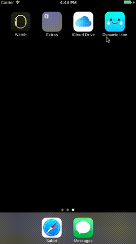

# Dynamic AppIcon - iOS 10.3



## Project Integration
* Set target to minimum iOS 10.3
* Add your Alternate icons onto your project (assets seems not to work)
* Deal with Info.plist (example):


```
<key>CFBundleIcons</key>
	<dict>
		<key>CFBundleAlternateIcons</key>
		<dict>
			<key>adn</key>
			<dict>
				<key>CFBundleIconFiles</key>
				<array>
					<string>adn</string>
				</array>
				<key>UIPrerenderedIcon</key>
				<false/>
			</dict>
			<key>home</key>
			<dict>
				<key>CFBundleIconFiles</key>
				<array>
					<string>home</string>
				</array>
				<key>UIPrerenderedIcon</key>
				<true/>
			</dict>
			<key>soccer</key>
			<dict>
				<key>CFBundleIconFiles</key>
				<array>
					<string>soccer</string>
				</array>
				<key>UIPrerenderedIcon</key>
				<false/>
			</dict>
		</dict>
		<key>CFBundlePrimaryIcon</key>
		<dict>
			<key>CFBundleIconFiles</key>
			<array>
				<string>AppIcon60x60</string>
			</array>
		</dict>
	</dict>

```

## In-Code integration


* Set an alternate icon:

```
    guard UIApplication.shared.supportsAlternateIcons else { return }
    
    UIApplication.shared.setAlternateIconName("AlternateIconName") { err in
        if let err = err {
            print("/!\\ Woops ! \(String(describing: err))")
        }
    }
```


* Reset to the primary icon:

```
    guard UIApplication.shared.supportsAlternateIcons else { return }
    
    UIApplication.shared.setAlternateIconName(nil) { err in
        if let err = err {
            print("/!\\ Woops ! \(String(describing: err))")
        }
    }
```

For the moment, this crashes:

```
    UIApplication.shared.setAlternateIconName(nil) // nilled closure with nilled icon name
```
